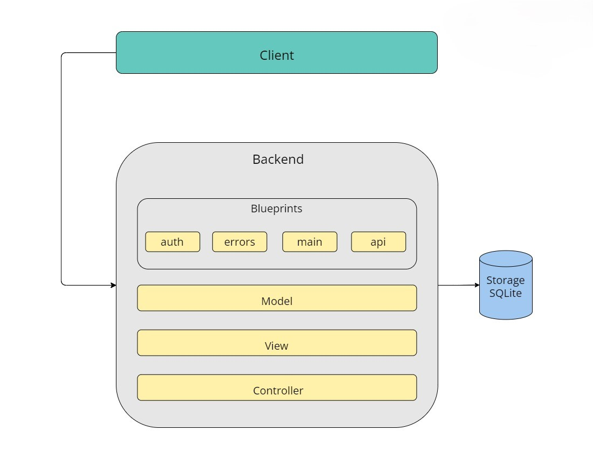

# Punk-rock band website

Проект представляет собой веб-сайт рок-группы. В основе построения архитектуры лежит REST подход; бэкенд логически разделён на сервисы (Blueprints):
- auth - работа с учётными записями пользователей;
- errors - обработка клиентских и серверных ошибок;
- main - логика самого музыкального сайта;
- api - предоставляет "точки входа" для различных клиентов, помимо браузеров, реализуя JSON-API.


### Архитектура



### Технологии

- python
- пакеты python из файла requirements.txt
- make

### Структура

```shell
.
├── app
│   ├── api
│   │   ├── __init__.py
│   │   ├── auth.py
│   │   ├── errors.py
│   │   ├── tokens.py
│   │   └── users.py
│   ├── auth
│   │   ├── __init__.py
│   │   ├── email.py
│   │   ├── forms.py
│   │   └── routes.py
│   ├── errors
│   │   ├── __init__.py
│   │   ├── handlers.py
│   ├── main
│   │   ├── __init__.py
│   │   └── routes.py
│   ├── static
│   ├── templates
│       ├── auth/
│       ├── email/
│       ├── errors/
│       ├── main/
│       ├── base.html
│       ├── footer.html
│       └── nav.html
│   ├── __init__.py
│   ├── models.py
│   └── email.py
├── Makefile
├── migrations
├── requirements.txt
├── config.py
├── runner.py
└── Volume
    └── myapp.db
```

### Подготовка и запуск

#### Установка

- установить python в вашей ОС
- установить make в вашей ОС
- склонировать репозиторий

#### Запуск

- при первом запуске (для настройки проекта и запуска): запустить `make launch`
- при последующих запусках: `make run`

### Дополнительно

- при развертывании на удаленной машине используйте `docker`

### Ссылки

- документация flask: https://flask.palletsprojects.com/en/3.0.x/
- документация jinja2: https://jinja.palletsprojects.com/en/3.1.x/

### API

---

- api/users/<int:id> GET
- api/users GET
- api/users/<int:id> PUT
- api/users POST
- api/concerts/<int:id> GET
- api/concerts GET
- api/tokens POST
- api/tokens DELETE